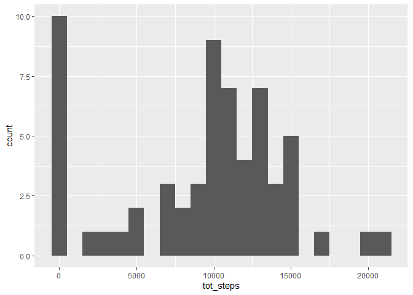
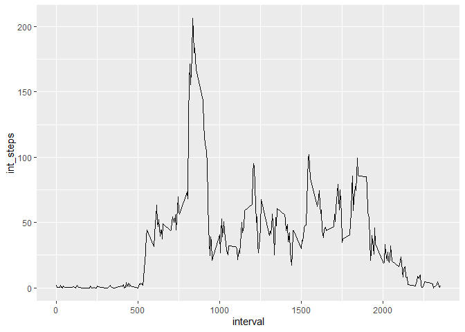
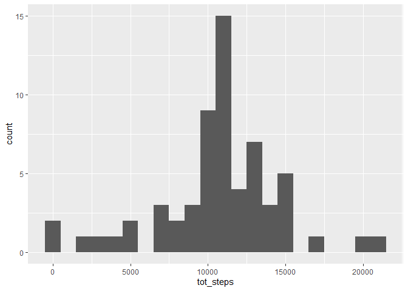
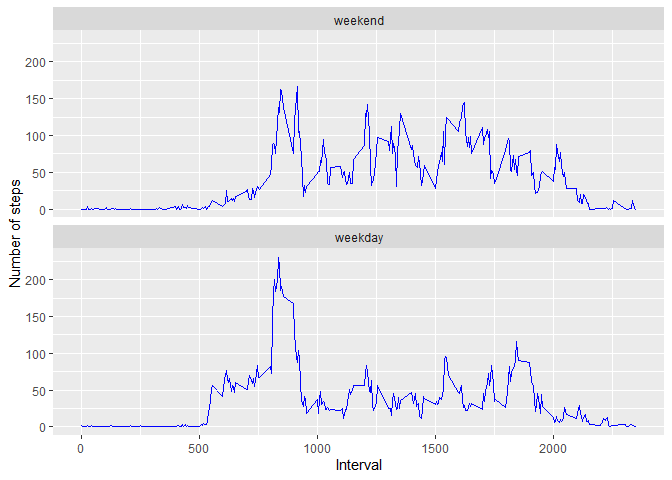

```r
library(dplyr)
```

```
## 
## Attaching package: 'dplyr'
```

```
## The following objects are masked from 'package:stats':
## 
##     filter, lag
```

```
## The following objects are masked from 'package:base':
## 
##     intersect, setdiff, setequal, union
```

```r
library(ggplot2)
library(lattice)
library(vroom)
```

## Loading and preprocessing the data

```r
raw <- vroom("activity.zip")
```

```
## Rows: 17568 Columns: 3
```

```
## -- Column specification --------------------------------------------------------
## Delimiter: ","
## dbl  (2): steps, interval
## date (1): date
```

```
## 
## i Use `spec()` to retrieve the full column specification for this data.
## i Specify the column types or set `show_col_types = FALSE` to quiet this message.
```

```r
str(raw)
```

```
## spec_tbl_df [17,568 x 3] (S3: spec_tbl_df/tbl_df/tbl/data.frame)
##  $ steps   : num [1:17568] NA NA NA NA NA NA NA NA NA NA ...
##  $ date    : Date[1:17568], format: "2012-10-01" "2012-10-01" ...
##  $ interval: num [1:17568] 0 5 10 15 20 25 30 35 40 45 ...
##  - attr(*, "spec")=
##   .. cols(
##   ..   steps = col_double(),
##   ..   date = col_date(format = ""),
##   ..   interval = col_double(),
##   ..   .delim = ","
##   .. )
##  - attr(*, "problems")=<externalptr>
```


## What is mean total number of steps taken per day?

```r
total_steps <- raw %>% group_by(date) %>% summarise(tot_steps = sum(steps, na.rm = TRUE))
ggplot(total_steps, aes(x=tot_steps)) + geom_histogram(binwidth = 1000)
```

<!-- -->

```r
data_mean <- mean(total_steps$tot_steps)
data_median <- median(total_steps$tot_steps)
```
The mean is: __9354.23__.  
The median is: __10395.00__.


## What is the average daily activity pattern?

```r
interval_steps <- raw %>% group_by(interval) %>% summarise(int_steps = mean(steps, na.rm = TRUE))
ggplot(data=interval_steps, aes(x=interval, y=int_steps)) + geom_line()
```

<!-- -->

```r
max_interval_steps <- interval_steps[which.max(interval_steps$int_steps),]
```
The __835__ interval contains the maximum number of steps.


## Imputing missing values

```r
raw %>% count(is.na(steps))
```

```
## # A tibble: 2 x 2
##   `is.na(steps)`     n
##   <lgl>          <int>
## 1 FALSE          15264
## 2 TRUE            2304
```

```r
imputed_data <- as.data.frame(raw)
imputed_data$imputed <- is.na(imputed_data$steps)

tmp <- imputed_data[c(imputed_data$imputed),] %>% left_join(interval_steps, by="interval")
imputed_data[c(imputed_data$imputed),]$steps <- tmp$int_steps

imputed_data %>% count(is.na(steps))
```

```
##   is.na(steps)     n
## 1        FALSE 17568
```

```r
total_steps2 <- imputed_data %>% group_by(date) %>% summarise(tot_steps = sum(steps, na.rm = TRUE))
ggplot(total_steps2, aes(x=tot_steps)) + geom_histogram(binwidth = 1000)
```

<!-- -->

```r
data_mean2 <- mean(total_steps2$tot_steps)
data_median2 <- median(total_steps2$tot_steps)
```
The mean is: __10766.19__.  
The median is: __10766.19__.


## Are there differences in activity patterns between weekdays and weekends?

```r
imputed_data$weekdays <- weekdays(imputed_data$date, TRUE)
imputed_data$weekends <- factor(ifelse(imputed_data$weekdays %in% c("Sat", "Sun"), "weekend", "weekday"),
                                   levels = c("weekday", "weekend"))

interval_steps2 <- imputed_data %>% group_by(interval, weekends) %>% summarise(int_steps = mean(steps, na.rm = TRUE))
```

```
## `summarise()` has grouped output by 'interval'. You can override using the `.groups` argument.
```
Plot using __lattice__:

```r
xyplot(int_steps ~ interval|weekends , interval_steps2, type="l", xlab="Interval", ylab="Number of steps", layout=c(1,2))
```

<!-- -->
  
Plot using __ggplot2__:

```r
ggplot(data=interval_steps2, aes(x=interval, y=int_steps)) +
  geom_line(col="blue") +
  xlab('Interval') + ylab('Number of steps') +
  facet_wrap(weekends ~ ., ncol = 1, as.table = FALSE)
```

<!-- -->
